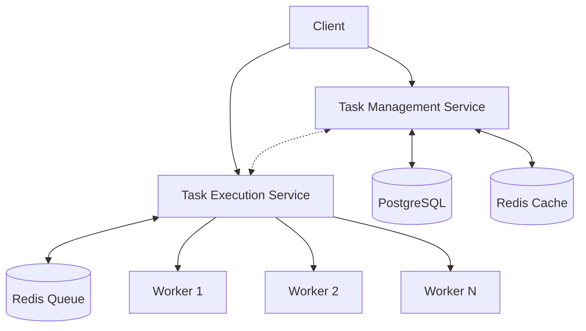
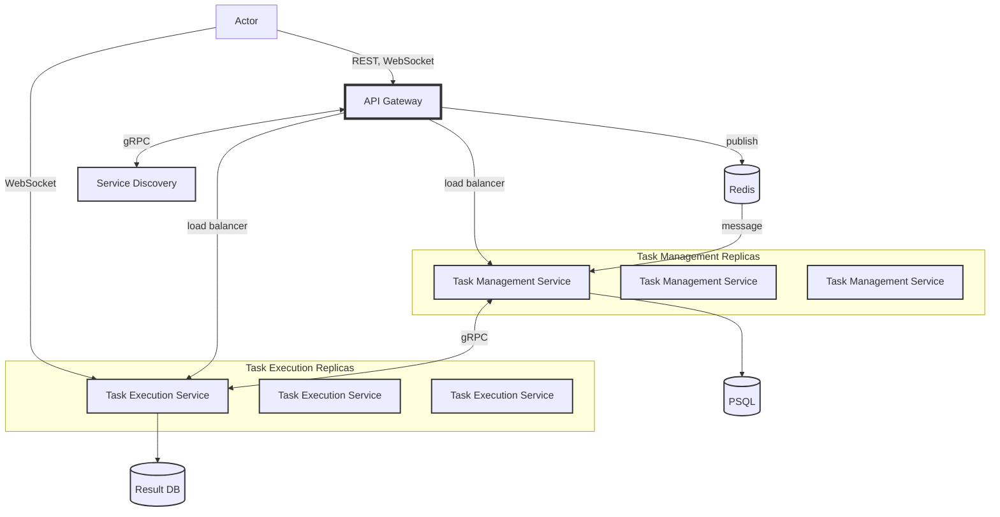

# Distributed Task Queue System Overview

## 1. Application Suitability Assessment

Our distributed task queue system is highly suitable for a microservices architecture for the following reasons:

1. **Scalability**: The system can handle varying loads by scaling individual components independently. This is particularly important for processing diverse task types with different resource requirements.
2. **Modularity**: Task submission, execution, and monitoring are separate concerns that can be developed and maintained independently.
3. **Technology Diversity**: Different services can use appropriate technologies (Python for task management, Node.js for execution).
4. **Fault Isolation**: Issues in one service (e.g., task execution) don't directly affect others (e.g., task submission).
5. **Independent Deployment**: Services can be updated or deployed separately, reducing downtime and risk.
6. **Task Diversity**: The system can handle a wide range of task types, from quick text processing to long-running simulations, demonstrating its flexibility.

Real-world examples of similar systems using microservices:

- **Celery**: An asynchronous task queue used by Instagram and Mozilla.
- **Apache Airflow**: A workflow management platform used by Airbnb and Lyft.
- **AWS Step Functions**: A serverless workflow service used by NASA and Intuit.

## 2. Service Boundaries

Here's a simple system architecture diagram:

V1


V2


Service boundaries:
1. **Task Management Service**: Handles task submission, status updates, and result retrieval.
2. **Task Execution Service**: Manages workers, distributes tasks, and processes results.

## 3. Technology Stack and Communication Patterns

### Task Management Service:
- Language: Python
- Framework: Flask
- Database: PostgreSQL
- Cache: Redis
- Communication: RESTful APIs (synchronous)

### Task Execution Service:
- Language: Node.js
- Framework: Express.js with Socket.IO
- Queue: Redis
- Communication:
  - RESTful APIs (synchronous) for worker management
  - WebSockets (real-time) for task status updates
  - Redis queue (asynchronous) for task distribution

### Containerization and Orchestration:
- Technology: Docker and Docker Compose
- Purpose: Containerization and orchestration of services

Docker Compose will be used to define and manage our multi-container Docker application. This approach offers several benefits for scalability:

1. **Service Definition**: Each component (Task Management Service, Task Execution Service, PostgreSQL, Redis) will be defined as a service in a `docker-compose.yml` file. This allows for easy configuration and deployment of the entire stack.

2. **Easy Scaling**: Docker Compose allows for easy scaling of services using the `--scale` option. For example:

3. **Network Isolation**: Docker Compose creates a default network for the application, ensuring services can communicate securely while remaining isolated from the host network.

4. **Volume Management**: Persistent data (for PostgreSQL and Redis) can be managed using named volumes, ensuring data persistence across container restarts and updates.

5. **Environment Configuration**: Environment variables can be easily managed for each service, allowing for configuration changes without modifying the container images.

6. **Load Balancing**: When scaling services, Docker Compose can work in conjunction with a reverse proxy (e.g., Nginx or Traefik) to distribute incoming requests across multiple container instances.

7. **Rolling Updates**: Docker Compose facilitates rolling updates, allowing for zero-downtime deployments when updating services.

This containerized approach provides a foundation for further scalability options, such as transitioning to Kubernetes for more advanced orchestration and scaling capabilities as the system grows.

## 4. Data Management

### Task Management Service Endpoints:

1. POST /api/tasks
   - Input:
     ```json
     {
       "type": "string",
       "data": "json"
     }
     ```
   - Output:
     ```json
     {
       "task_id": "integer"
     }
     ```

   Example task types:
   - Text processing: word_count, sentiment_analysis, text_summarization
   - Image processing: image_resize, apply_filter
   - Data analysis: calculate_statistics, find_patterns
   - External API interaction: weather_data, currency_conversion
   - Simulated long-running tasks: simulate_backup, large_file_processing

2. GET /api/tasks/{id}
   - Input: None
   - Output:
     ```json
     {
       "id": "integer",
       "type": "string",
       "status": "string",
       "result": "json"
     }
     ```

3. GET /api/tasks
   - Input: None
   - Output:
     ```json
     [
       {
         "id": "integer",
         "type": "string",
         "status": "string"
       }
     ]
     ```

4. DELETE /api/tasks/{id}
   - Input: None
   - Output:
     ```json
     {
       "message": "string"
     }
     ```

### Task Execution Service Endpoints:

1. WebSocket: /socket.io/{task-type}
   - Event: 'task_update'
   - Data:
     ```json
     {
       "id": "integer",
       "status": "string",
       "result": "json"
     }
     ```

2. GET /api/workers
   - Input: None
   - Output:
     ```json
     [
       {
         "id": "string",
         "startTime": "datetime"
       }
     ]
     ```

3. POST /api/workers
   - Input: None
   - Output:
     ```json
     {
       "workerId": "string"
     }
     ```

4. DELETE /api/workers/{id}
   - Input: None
   - Output:
     ```json
     {
       "message": "string"
     }
     ```

Data Management Strategy:
- Task Management Service uses PostgreSQL for persistent storage of tasks.
- Redis is used for caching task details and as a distributed queue.
- Task Execution Service uses in-memory storage (Map) for worker information.
- Tasks are stored in Redis queue for distribution to workers.

## 5. Worker Implementation

Workers in this system are not traditional threads, but rather long-running processes within the Task Execution Service:

1. **Independent Execution Units**: Each worker operates independently, pulling tasks from the shared Redis queue.
2. **Asynchronous Processing**: Workers use Node.js's event loop and async/await for non-blocking task processing.
3. **Scalability**: Multiple workers can run concurrently, each in its own process, potentially on different machines.

Worker implementation:

```javascript
async function taskWorker(workerId) {
    while (workers.has(workerId)) {
        const taskJson = await redis.brpop('task_queue', 0);
        const task = JSON.parse(taskJson[1]);

        console.log(`Worker ${workerId} processing task: ${task.id}`);

        io.emit('task_update', { id: task.id, status: 'processing' });

        const result = await processTask(task);

        await redis.hset(`task:${task.id}`, 'status', 'completed', 'result', JSON.stringify(result));

        io.emit('task_update', { id: task.id, status: 'completed', result });
    }
}
```

This implementation allows for handling various task types, from quick text processing to long-running simulations, demonstrating the system's flexibility.

## 6. Deployment and Scaling 

- **Containerization**: Both services will be containerized using Docker for consistent deployment across environments.
- **Orchestration**: Kubernetes will be used for orchestrating the containers, allowing for easy scaling and management.
- **Scaling Strategy**:
  - Task Management Service: Horizontal scaling based on incoming request load.
  - Task Execution Service: Scaling based on queue length and worker capacity. The number of workers can be dynamically adjusted based on the workload.
- **Load Balancing**: Kubernetes Ingress or a dedicated load balancer (e.g., Nginx) will distribute incoming requests across service instances.
- **Worker Distribution**: Workers can be distributed across multiple nodes in a Kubernetes cluster, allowing for efficient resource utilization and fault tolerance.

This updated overview incorporates the specific task types and worker implementation details, providing a more comprehensive picture of the distributed task queue system.
